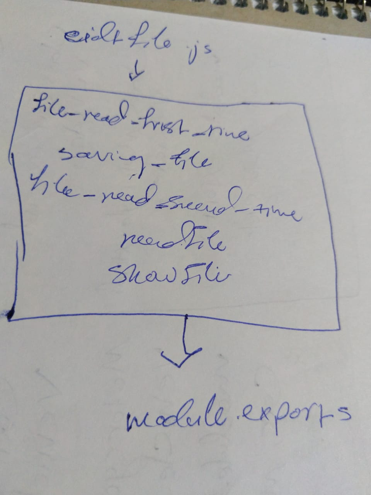

# LAB - Class 03

## Project Name

### Author: Ibrahim

### Links and Resources

* [submission PR](https://github.com/401-advanced-javascript-ibrahim/async/pull/1)
* [ci/cd](https://github.com/401-advanced-javascript-ibrahim/async/actions) (GitHub Actions)

### Setup

#### Tests

* How do you run tests?
  - `npm run test`
* Any tests of note?
  - no

#### UML

